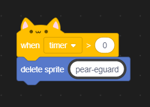

*Written by* **@bambus80** *for the Scratch OS Security Alliance*
# Zero-time execution in Scratch

### What is it?
Zero-time exectution is a method of execution that allows to run a script instantly on importing a sprite or stopping the project and it is achieved very simply by using the `when timer > 0` hat block. In most Scratch projects, it is used for project stop feedback, for example, an animation that runs when the user clicks the stop button on Scratch.

### Usage in breaking security
Zero-time execution is pretty much undefeatable. It runs without user input and runs before any check from software protection, such as Pear eGuard. While it doesn't last for a long time, that window of time is enough to cause serious harm.

### Deleting Pear eGuard
> Payload available at `/demo/eguard-remover.pox` for pastaOS Sedani and above. Note that this will only work on older builds of pastaOS Sedani, the newer ones automatically download Pear eGuard on its removal.

Let's take pastaOS as an example. It comes with a piece of software called Pear eGuard on board for detecting and removimg malicious software from the computer. But let's say that we're not interested in having Pear eGuard on our OS *for educational purpouses*. Well, that's very simple! We install a .pox application with the script below...

...and boom, no more eGuard! Now, obviously, this piece of code is quite dangerous and a malware developer's dream and if a program contains this script somewhere, you clearly should ***not*** install it. It also could be way more dangerous than that. Removing eGuard is one of the more safe things zero-time execution can do, on the other side you have entire malware payloads.

# Potential fixes
You probably shoudn't bother. I'm not saying that to be malicious, it's just that it's physically impossible to do it in Scratch. You can try, but it's probably going to fail.

### Timer reset loop
A potential solution could be always resetting the global Scratch timer in a forever loop. The timer will always be 0, which is not more than 0 so `when timer > 0` will not activate. This will render the built-in timer de facto useless, but you can get around this using the `days since 2000` block, which in fact offers better accuracy than the timer.

Sounds great, right? Well, the `when timer >` block allows for entering negative values so we can just make a `when timer > -1` block, which will always run as the timer will always be above -1 because it can't go negative.